# portfolio-ai
A project to manage all the stuff I am generating using AI

# Install 

The tool uses ffmpeg to process video files please install : 

- ffmpeg : https://www.ffmpeg.org/download.html

Download the release for your environment

Windows : portfolai-win.exe
Linux   : portfolai-linux
Mac     : Portfolai.app.zip

# Files

Create an install directory 

~/portfolai/       - Application file  
~/portfolai/IMAGES - with at least 1 sub directory of images
~/portfolai/VIDEOS - with at least 1 sub directory of videos 

# SETUP

Running the executable will launch the setup screen

- select the $PWD option to install in the directory it is being run in

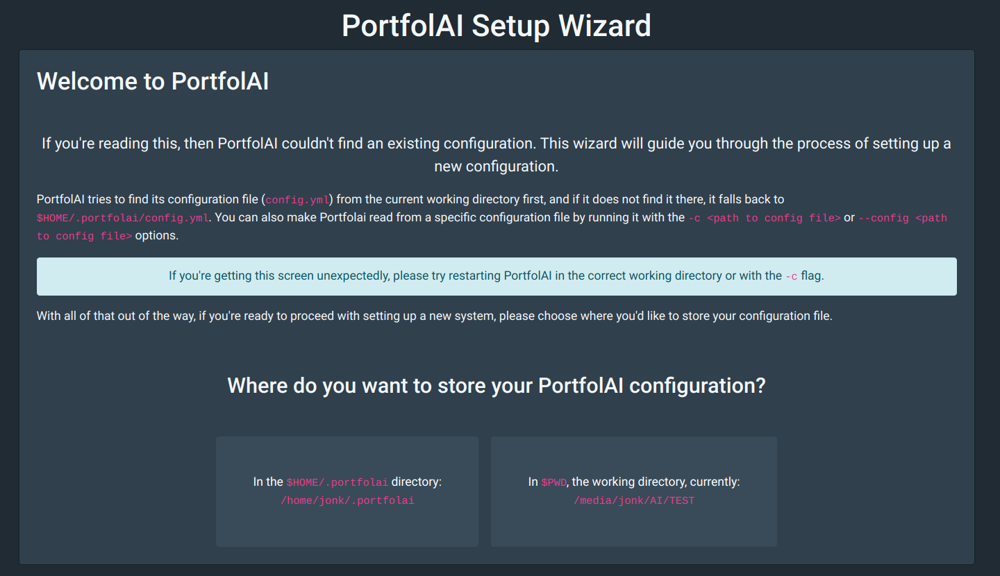

- add the directories IMAGES and VIDEOS
- Keep others as default and hit Next

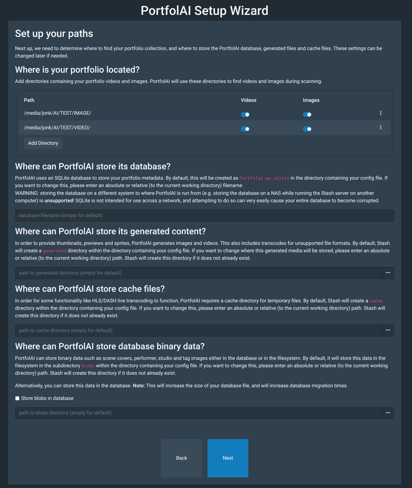

- Select Confirm

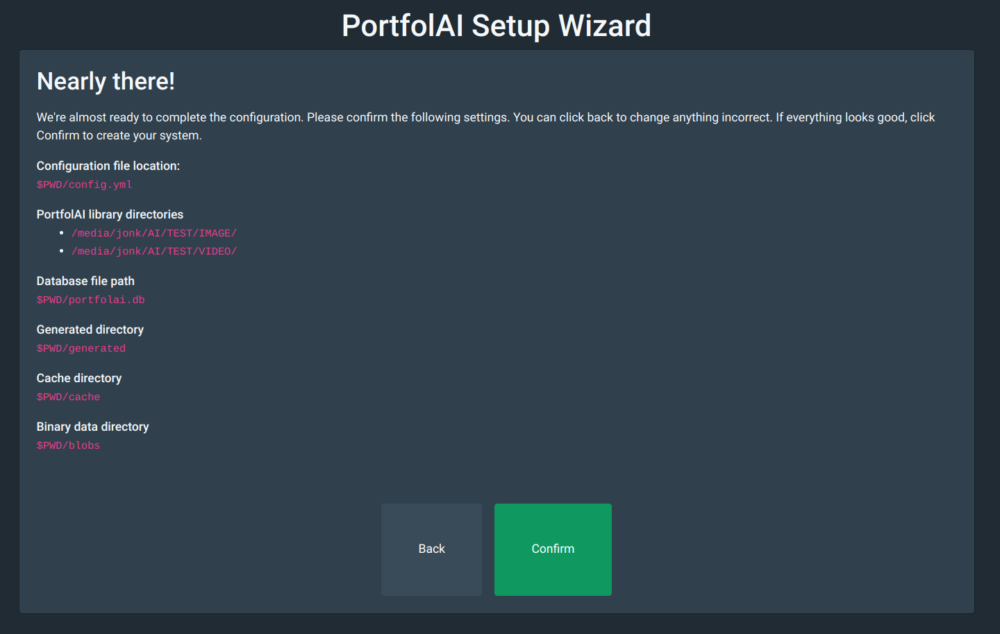

- Select Finish

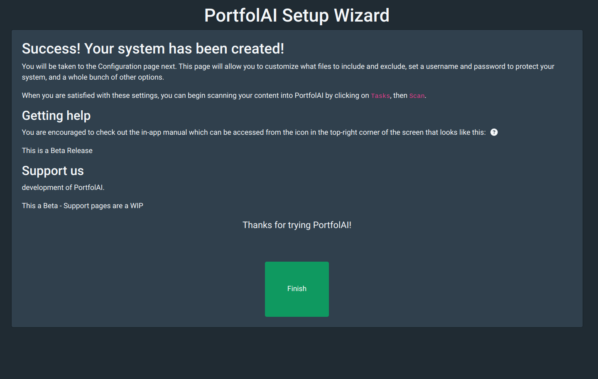

# Settings

- The library should show the currently configured directories

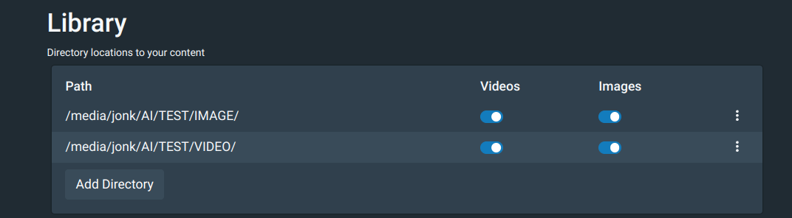

- The following Video and Image file extentions are supported

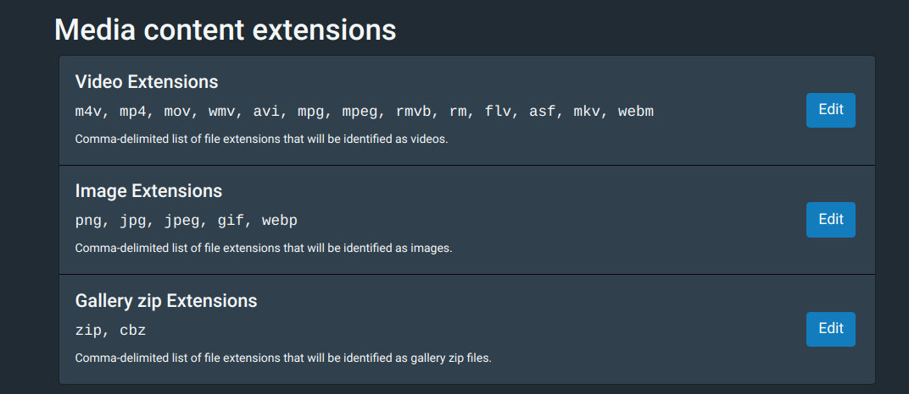

- The following settings can be used to exclude files

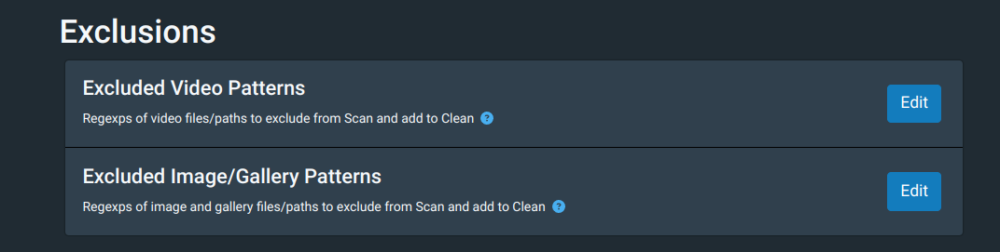

- The following change how galleries and images are processed 
- Please turn on **'Create galleries from folders containing images'**

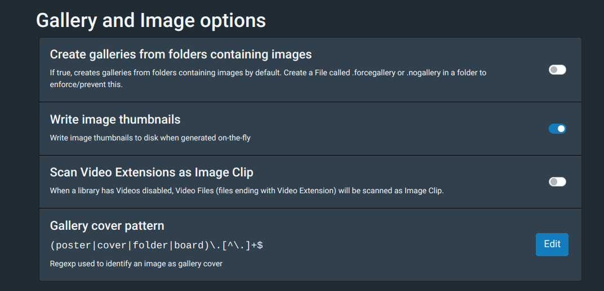

# System

- If you need to install FFmpeg then it Download FFmpeg 

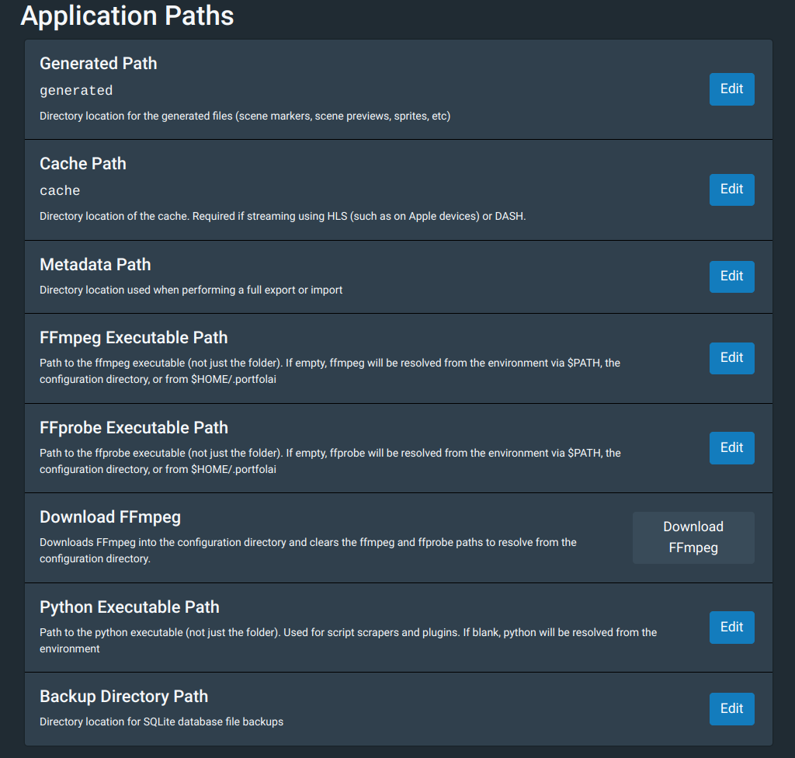

# Tasks

- Turn all options on 
- Select ***Scan***

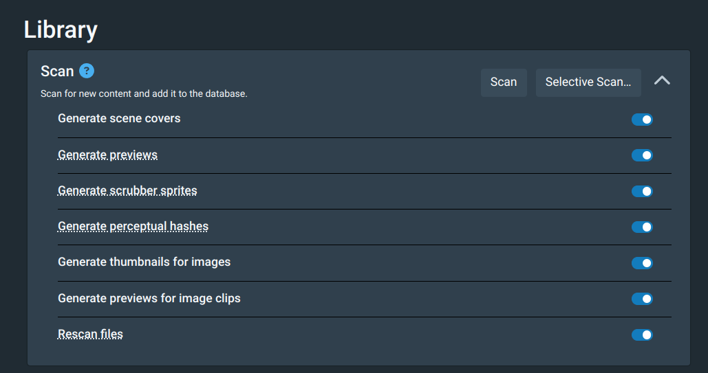

- Wait for Task to finish
  
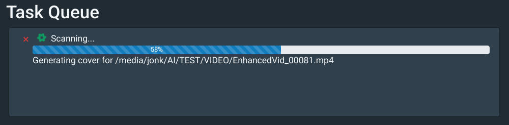

- Turn all options on 
- Select ***Generate*** 

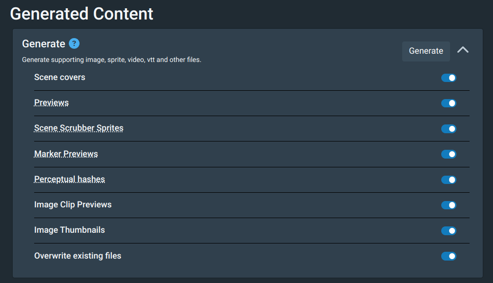

# Portfolio

- Select ***PortfolAI** to go to the home page

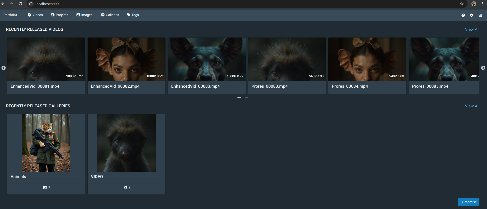

- Select your video to see more details

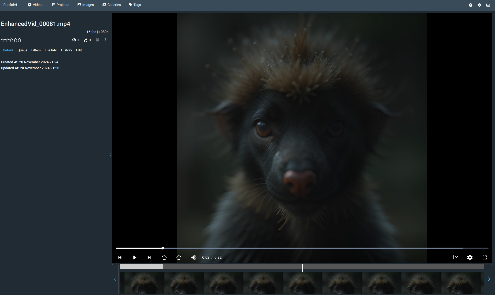

- Select a recently added gallery to view image details

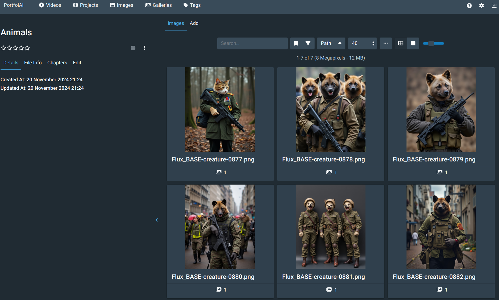

# What Next 

- ***Please Explore !***